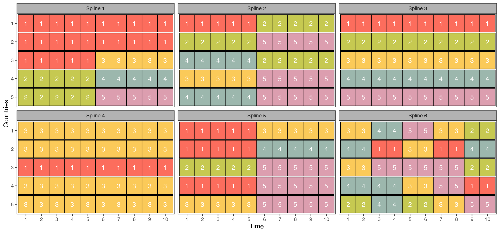
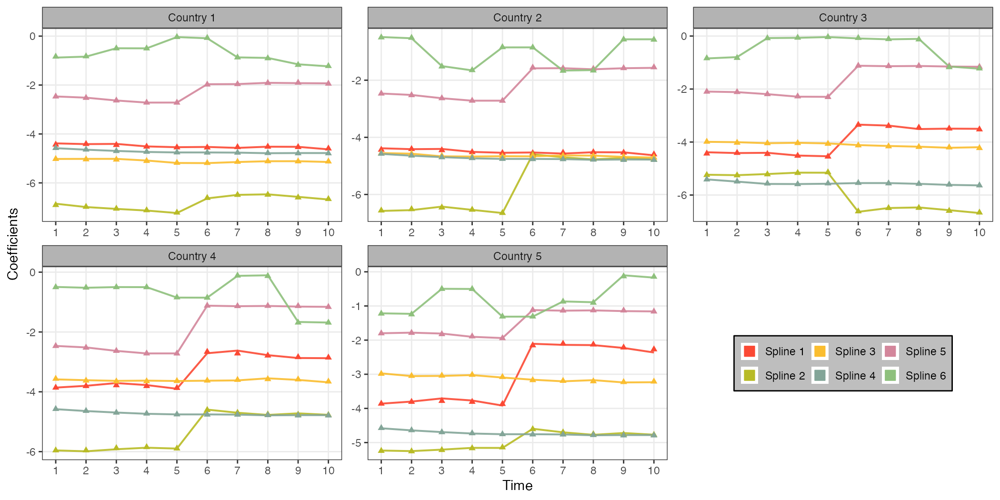

# Simulation study — first scenario (Section 4.1)

This tutorial reproduces the **first simulation scenario** of the paper
[*Bayesian local clustering of age-period mortality surfaces across multiple countries*](https://arxiv.org/abs/2504.05240),
in which synthetic log-mortality rates are generated **under the proposed model**.
 The goal of the study is to assess to what extent the proposed formulation is able to recover (i) complex local grouping structures among countries that vary across ages and periods, and (ii) the associated cluster-specific coefficients.

The analysis proceeds in three steps:

1. [simulating the data](#1-data-generating-mechanism) and displaying the [true local clustering structure](#2-true-local-clustering-structure);
2. [running the Gibbs sampler](#3-posterior-computation) and storing posterior summaries of interest, i.e. the sequence of estimated posterior similarity matrices and partition point estimates in `coclust.RDS`, and the posterior means of the conutry-specific spline coefficients in `beta_countries.RDS`;
3. [assessing the recovery of the local grouping structures](#4-co-clustering);
4. [comparing estimated and true trajectories](#5-estimated-versus-true-coefficients) of the country-specific coefficients.

The code is meant to be run from within this folder, and the core routines are sourced from [`main/`](../main). 

```r
library(ggplot2)

source("../main/utils.R")
source("../main/simulate_data.R")

set.seed(4321)

## Common palette for clusters and spline bases
gb <- paste0("#", c("fb4934", "b8bb26", "fabd2f", "83a598", "d3869b"))
```

---

## 1. Data-generating mechanism

We simulate log-mortality rates for `n = 5` synthetic countries, observed over `T = 10` periods and
for the ages `X = {0, 1, ..., 100}`. Data are generated under equations (1)–(3) of the paper and splines
coefficient distribution centered around parallel lines:

```
log m_ixt = f_it(x) + eps_ixt,          eps_ixt ~ N(0, sigma_i^2)
f_it(x)   = sum_{j=1}^p beta_ijt g_j(x)
beta_ijt  = theta_{c_ijt, j, t}
theta_kjt ~ N(phi_kjt, delta_j^2)        phi_kjt = intercept_{kjt} + slope * (t - 1)
```

so that the age structure of mortality is described by a B-spline expansion whose country-specific
coefficients `beta_ijt` are **tied** whenever two countries belong to the same cluster at the pair
(basis `j`, period `t`). 

Note that `(phi_kj1, ..., phi_kjT)` for different clusters `k` are parallel lines in time:
the paper fixes their common slope (`-0.02`), while their intercepts are chosen so that 
the resulting surfaces reproduce realistic levels of log-mortality across the age range. 
The default intercepts in `simulate_scenario_4_1()` are the ones used to produce the data analysed below.

```r
n  <- 5 # number of countries
TT <- 10 # number of time points
p  <- 6 # number of spline bases

sim      <- simulate_scenario_4_1(n = n, TT = TT, p = p)
clusters <- sim$clusters

str(sim$log_m)
#  num [1:5, 1:101, 1:10] -4.37 -4.33 -4.45 -3.82 -3.9 ...
#  - attr(*, "dimnames")=List of 3
#   ..$ : chr [1:5] "Unit1" "Unit2" "Unit3" "Unit4" ...
#   ..$ : chr [1:101] "0" "1" "2" "3" ...
#   ..$ : chr [1:10] "1" "2" "3" "4" ...
```

The object `sim` contains the simulated log-mortality array `log_m` (countries × ages × periods), the true country-specific coefficients `beta` (countries × bases × periods), the cluster-specific values `theta`, the true memberships `clusters` and the B-spline basis matrix `S`.

## 2. True local clustering structure

The cluster memberships `c_jt` are manually set as in `cluster_setting_4_1()` — in order to span a wide spectrum of time-varying local grouping patterns, and thereby stress-test the model in regimes that are progressively harder to recover:

- **bases 3 and 4** produce stable clusters over time (all countries separated for basis 3, and a single country isolated from the others for basis 4), albeit with rather different co-clustering patterns;
- **bases 1, 2 and 5** exhibit a single, structural change of the partition halfway through the observational window (between `t = 5` and `t = 6`);
- **basis 6** is the most challenging regime, with all the countries changing group membership frequently across the whole time window.

The resulting configuration is displayed below, (see also Figure 3 in the paper).

```r
df_pl <- reshape2::melt(clusters)
df_pl$value <- factor(df_pl$value)
df_pl$Var1  <- ordered(factor(df_pl$Var1), levels = 5:1)
df_pl$Var2  <- factor(df_pl$Var2)

plf <- ggplot(df_pl) +
  geom_tile(aes(Var2, Var1, fill = value, width = 1, height = 0.95),
            linewidth = .5, col = "black", show.legend = FALSE, alpha = .8) +
  geom_text(aes(Var2, Var1, label = value), col = "white", size = 5,
            show.legend = FALSE) +
  facet_wrap(~L1) +
  theme_bw(base_size = 14) +
  theme(panel.grid.major = element_blank(),
        panel.grid.minor = element_blank(),
        strip.background = element_rect(fill = "grey70")) +
  scale_x_discrete(expand = expansion(add = c(0.6))) +
  scale_y_discrete(expand = expansion(add = c(0.55))) +
  scale_fill_manual(values = gb) +
  xlab("Time") + ylab("Countries")

ggsave(plf, file = "img/sim_setting.png", width = 15, height = 7, dpi = 150)
```



## 3. Posterior computation

Posterior inference proceeds under the model proposed in Section 2 of the manuscript with diffuse hyperparameters
`a = b = a_tau = b_tau = a_lambda = b_lambda = 1e-3`, `a_M = 2e-3`, `b_M = 1e-3` and
`a_alpha = b_alpha = 1`. The entries of the GP covariance matrix `Lambda` are defined through a
squared-exponential kernel with length scale 1.5, i.e. `Lambda[t,t'] = exp(-0.5 (t - t')^2 / 1.5^2)`,
while the mean vectors `mu_j` are elicited in a data-driven manner: for each period, the spline
coefficients are first estimated via OLS under (1)–(2), and then smoothed over time via LOESS.

The Gibbs sampler is run for 20,000 iterations, discarding the first 10,000 as a conservative
burn-in. Traceplots and autocorrelation plots indicate satisfactory mixing of the chains. The 10,000
retained samples are then summarised, as detailed in Section 3.2 of the manuscript, into the two
quantities of interest.

- **the cluster memberships.** For each basis `j = 1, ..., 6` and period `t = 1, ..., 10`, the
  samples of `c_jt` are first summarised into the posterior co-clustering matrix `P_jt`, whose
  generic entry is the proportion of samples in which countries `i` and `i'` share the same group.
  A single point estimate `c_jt` is then obtained by minimising the posterior expected variation of
  information (Wade & Ghahramani, 2018) — `minVI()` in the `mcclust.ext` package — using `P_jt` as
  input. The results are stored in `coclust.RDS`, together with the true cluster allocations.
- **the spline coefficients.** Point estimates for the country-specific trajectories `beta_ijt = theta_{c_ijt, j, t}`
  are obtained as posterior means and stored in `beta_countries.RDS` alongside the values used to generate the data.

```r
source("../main/gibbs_tRPM.R")

out_MCMC <- run_model(Y = sim$log_m, ages = sim$ages,
  n_iter = 2e4, print_step = 500,
  a_alpha = 0.01, b_alpha = 1, a_delta = 0.001, b_delta = 0.001, 
  a_omega = 0.001, b_omega = 0.001,
  name_save = "res_simstudy_scenario1.RDS")

burnin = 1:1e4

# Inference on partition
psm               <- compute_prob_coclust(import = FALSE, save = FALSE, draws = out_MCMC$res$labels, burnin = burnin)
ppe               <- compute_partition_point_est(psm = psm, draws = out_MCMC$res$labels, save = FALSE, burnin = burnin)
summary_partition <- summarise_clusters(ppe = ppe, psm = psm, clusters_true = clusters)
coclust           <- list(psm = psm, ppe = ppe, true = clusters)

# Inference on individual coefficients
beta_est       <- compute_beta_units(draws_beta = out_MCMC$res$beta, draws_labs = out_MCMC$res$labels, burnin = burnin)
beta_countries <- summarise_beta(beta_est, sim$beta)

saveRDS(coclust, "coclust.RDS")
saveRDS(beta_countries, "beta_countries.RDS")
```

> **Note.** To be added

## 4. Co-clustering

This section compares the estimated posterior similarity matrices with the true partitions displayed in Section 2, 
and report the co-clustering accuracies of Table 1 of the paper, i.e. the posterior mean, for each pair `(j, t)`, of the percentage of pairs of
countries that are correctly co-clustered.

```r
summary_partition <- summarise_clusters(ppe = ppe, psm = psm, clusters_true = clusters)
summary_partition$psm_acc

#          Year
# Spline          1       2       3       4       5       6       7       8       9      10
#   Spline1 0.98986 0.99697 0.99911 0.99335 0.96822 0.99991 0.99998 0.99998 0.99989 0.99975
#   Spline2 0.99600 0.99914 0.99948 0.99997 0.99869 0.98999 0.99916 0.99919 0.99978 0.99612
#   Spline3 1.00000 1.00000 1.00000 1.00000 1.00000 1.00000 1.00000 1.00000 1.00000 1.00000
#   Spline4 0.99105 0.99988 0.99925 0.99985 0.99782 0.99964 0.99952 0.99892 0.97704 0.98113
#   Spline5 0.99587 0.99882 0.99992 0.99958 0.99327 0.99688 0.99992 0.99920 0.99912 0.99354
#   Spline6 0.90617 0.89123 0.95522 0.95565 0.98097 0.97697 0.97932 0.98105 0.98754 0.98817

# Prepare Tex table (Table 1 in the manuscript)
toTex <- matrix(round(summary_partition$psm_acc, 3), nrow = p, ncol = TT)
rownames(toTex) <- paste0("Spline ", 1:p, " $(j = ", 1:p, ")$")
colnames(toTex) <- paste0("$t=", 1:TT, "$")
print(xtable::xtable(toTex, align = rep("c", 11)), sanitize.text.function = identity)
```

## 5. Estimated versus true coefficients

The file `beta_countries.RDS` stores, for every country (`Unit`), spline basis (`Spline`) and period
(`Year`), the posterior mean of the country-specific coefficient (`Beta_est`) alongside the value
used to generate the data (`Beta_true`).

```r
beta_countries <- readRDS("beta_countries.RDS")
head(beta_countries)
#    Unit  Spline Year  Beta_est Beta_true
# 1 Unit1 Spline1    1 -4.384382 -4.433928
# 2 Unit2 Spline1    1 -4.383117 -4.433928
# 3 Unit3 Spline1    1 -4.386075 -4.433928
# 4 Unit4 Spline1    1 -3.859353 -3.860657
# 5 Unit5 Spline1    1 -3.860789 -3.860657
# 6 Unit1 Spline2    1 -6.851310 -6.904459
```

The figure below (Figure 4 in the paper) compares the estimated trajectories (lines) with the true
ones (triangles), with one panel per country and one colour per spline basis.

```r
beta_df$Unit   <- gsub("Unit", "Country ", beta_df$Unit)
beta_df$Spline <- gsub("Spline", "Spline ", beta_df$Spline)

beta_pl <- ggplot(beta_df) +
  geom_line(aes(Year, Beta_est, col = Spline), alpha = .9,
            show.legend = FALSE, linewidth = .9) +
  geom_point(aes(Year, Beta_true, col = Spline), size = 2, shape = "triangle") +
  facet_wrap(~Unit, scales = "free") +
  theme_bw(base_size = 14) +
  scale_x_continuous(breaks = 1:10) +
  scale_color_manual(values = gb) +
  guides(color = guide_legend(title = NULL,
                              override.aes = list(shape = 22, size = 5, fill = gb))) +
  theme(panel.grid.minor  = element_blank(),
        strip.background  = element_rect(fill = "grey70"),
        legend.background = element_rect(fill = "grey", color = "black"),
        legend.key        = element_rect(fill = "white"),
        legend.position   = "right",
        legend.direction  = "horizontal") +
  xlab("Time") + ylab("Coefficients")

## the legend is moved into the empty panel of the facet grid
beta_pl <- lemon::reposition_legend(beta_pl, "center", panel = "panel-3-2",
                                    plot = FALSE)

ggsave(beta_pl, file = "img/sim_beta.png", width = 14, height = 7, dpi = 150)
```



